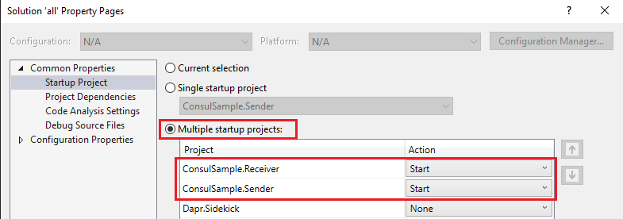
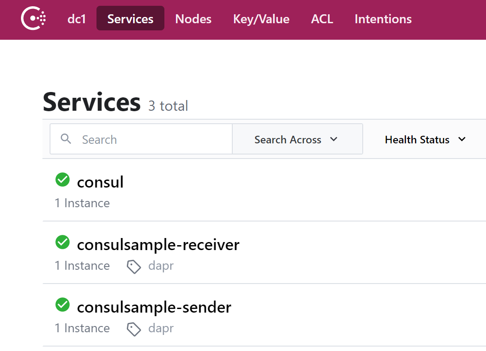

# Consul Sample

This example is based on the standard ASP.NET Core 5.0 Web API WeatherForecast template and demonstrates the Service Discovery and Invocation feature of standalone Dapr using Hashicorp Consul as a service discovery provider. While this sample runs on a single machine, it would work exactly the same way if the two services were on different machines with a central Consul cluster.

## Features

This sample demonstrates the following key features:

* A local Dapr `config.yaml` file is included in both services to configure Consul service discovery. The `Dapr:RuntimeDirectory` configuration property in `appsettings.json` instructs Dapr Sidekick to use this file to configure Dapr.
* A `/health` endpoint is exposed on both services which aggregates both the service and daprd health checks.  On startup Dapr registers the service `/health` endpoint with Consul which then polls it every 5 seconds for health.
* If you kill either `daprd` process the service will report unhealthy in Consul, within 5 seconds Dapr will restart and the service will again report healthy.
* Using the standard `properties\launchsettings.json` file the app ports are set to 5000 for Sender service and 5001 for Receiver service which Dapr Sidekick uses to configure the Dapr sidecar.
* A `/metrics` endpoint is exposed on both services which reports the Prometheus metrics exposed by the Dapr sidecar.

## Running the sample

The samples require Dapr 1.2 at a minimum which is the first release that included the Consul Service Discovery component.

You will also need an instance of Consul Server plus a Consul Agent running on the local default port 8500. The simplest approach is to download [Hashicorp Consul](https://www.consul.io/downloads) for your platform, extract the binary and run it in [local development](https://learn.hashicorp.com/tutorials/consul/get-started-agent) mode using the following command:

```bash
#  Start a local Consul Agent, Server and Web UI on port 8500
consul agent --dev
```

Open `all.sln` (located in the root of this repository) in Visual Studio 2019, select `Debug > Set Startup Projects`, select set both `ConsulSample.Receiver` and `ConsulSample.Sender` as startup projects:



Run the solution and two console windows will appear - one for each service. All ports will be automatically assigned, if there are any port clashes Dapr will be restarted with new assignments until it can start successfully.

> Unique ports can also be manually specified in `appsettings.json` to improve the startup process.

Open the Consul Server UI at http://127.0.0.1:8500 and both services should be registered and report healthy:



Navigate to http://localhost:5000/Sender/DaprWeatherForecast which will execute the `DaprWeatherForecast` method on the `Receiver` service via Dapr and Consul Service Discovery!

> If you have multiple instances of the Receiver service registered with Consul, Dapr will load balance the service calls across your healthy instances.
